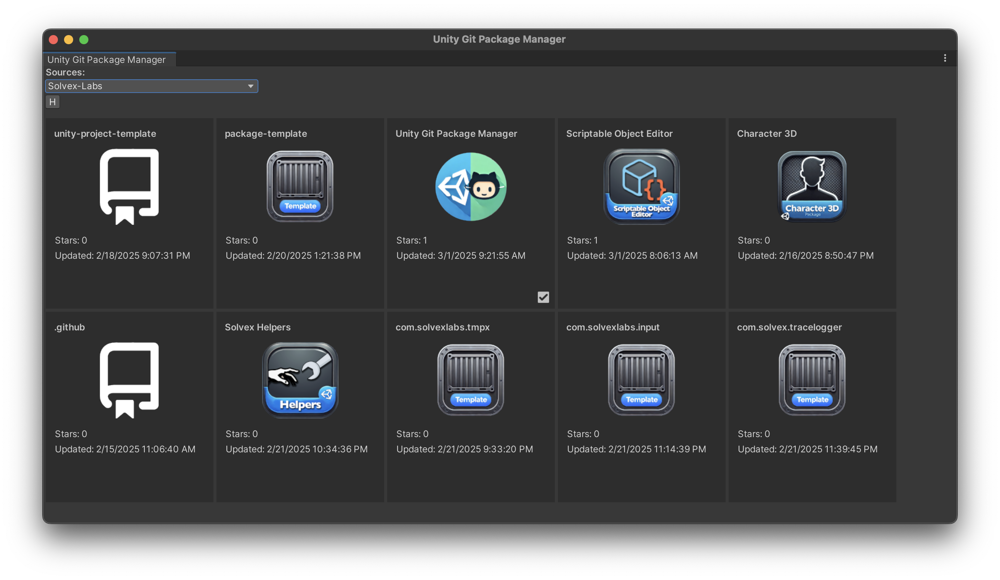
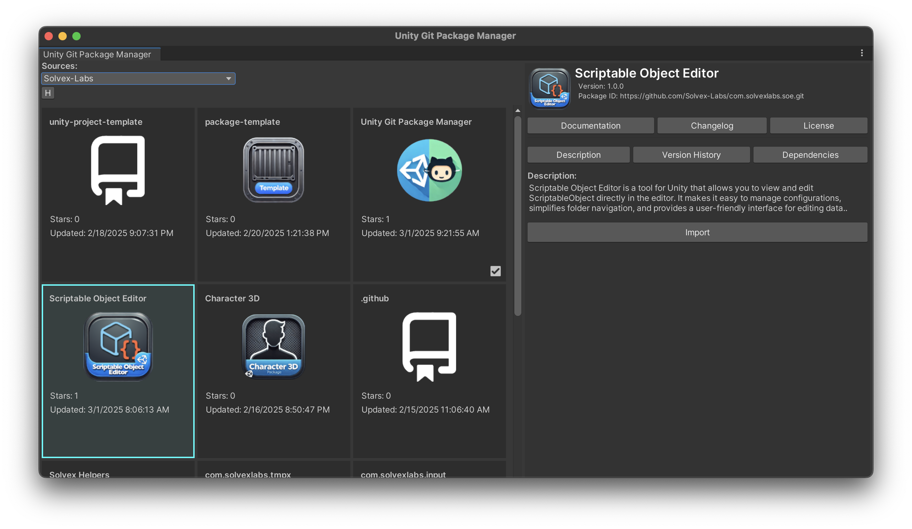
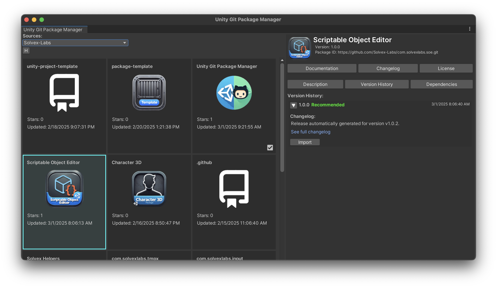

# Unity Git Package Manager (UGPM)

Unity Git Package Manager (UGPM) is a tool for conveniently managing packages in Unity via Git. It allows you to easily add, update, and remove packages using Git repositories without manually editing `manifest.json`.

## Features

- Support for installing packages directly from Git repositories
- Automatic package updates
- Removing packages from the project
- Support for private repositories using Git Credential Manager (GCM)
- Simplified interface for working with `Packages/manifest.json`
- Integration with Unity Package Manager (UPM)

## Installation

### Cloning via Unity Package Manager (UPM)

1. Open Unity.
2. Go to `Window > Package Manager`.
3. Click the `+` button in the top-left corner and select `Add package from git URL`.
4. Enter the repository URL:
   ```
   https://github.com/Solvex-Labs/com.solvexlabs.ugpm.git#{version}
   ```
   ### Example
   ```
   https://github.com/Solvex-Labs/com.solvexlabs.ugpm.git#v1.0.3
   ```
5. Click `Add` and wait for Unity to install the package.

### Cloning via manifest.json

1. Open Unity and navigate to your project's `Packages` folder.
2. Open `manifest.json` with a text editor.
3. Add the UGPM repository URL under `dependencies`. Use the appropriate release version:
   ```json
   {
     "dependencies": {
       "com.solvexlabs.ugpm": "git+https://github.com/Solvex-Labs/com.solvexlabs.ugpm.git#v1.0.3"
     }
   }
   ```
4. Save the file and restart Unity for the changes to take effect.
5. You can check available versions in the [Releases](https://github.com/Solvex-Labs/com.solvexlabs.ugpm/releases) section of the repository to select the correct version.

## Git Credential Manager (GCM)

To access private repositories and interact with GitHub's API, UGPM uses [Git Credential Manager (GCM)](https://github.com/git-ecosystem/git-credential-manager). GCM provides secure authentication without requiring manual entry of credentials every time you interact with a private repository.

### Why Use GCM?

- **Security**: Credentials are stored securely using the system’s credential store.
- **Convenience**: No need to repeatedly enter credentials when accessing private repositories.
- **Multi-platform Support**: Works on Windows, macOS, and Linux.

### More Information

For installation and configuration details, please visit the official Git Credential Manager repository on GitHub: [https://github.com/git-ecosystem/git-credential-manager](https://github.com/git-ecosystem/git-credential-manager)

## How to Use

### Opening UGPM

1. Open Unity.
2. Navigate to `Tools > Unity Git Package Manager` in the top menu.  

### Browsing Packages

1. The UGPM window will display a list of available packages from the selected source.  
   
2. Use the `Sources` dropdown to filter by organization (e.g., Solvex-Labs).
3. Browse through the packages and select the one you need.

### Installing a Package

1. Click on the package you want to install.  
   
2. The package details panel on the right will show its description, version, and repository link.
3. Click `Install` or select the desired version from the `Version History` tab.  
   

## Requirements

- Unity 2021.3 or newer
- Git installed on the system and accessible from the command line
- Internet access to download packages

## License

This project is licensed under the MIT License. See the [LICENSE](LICENSE) file for details.

## Contact

If you have any questions or suggestions, contact us:
- GitHub Issues: [https://github.com/Solvex-Labs/com.solvexlabs.ugpm/issues](https://github.com/Solvex-Labs/com.solvexlabs.ugpm/issues)

